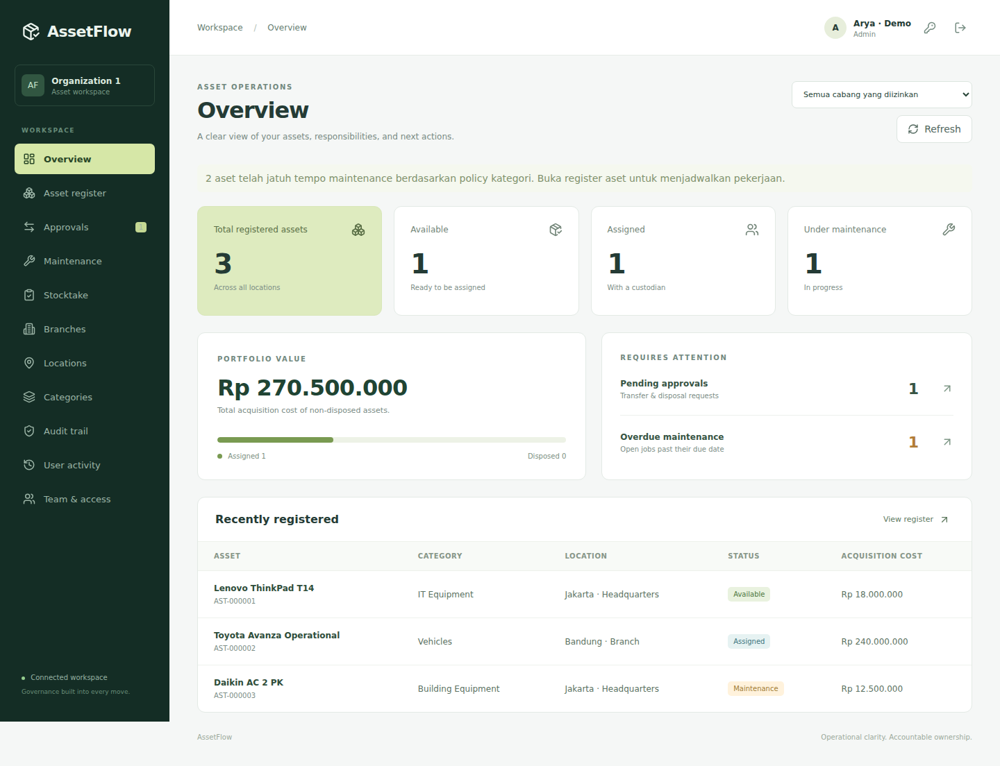
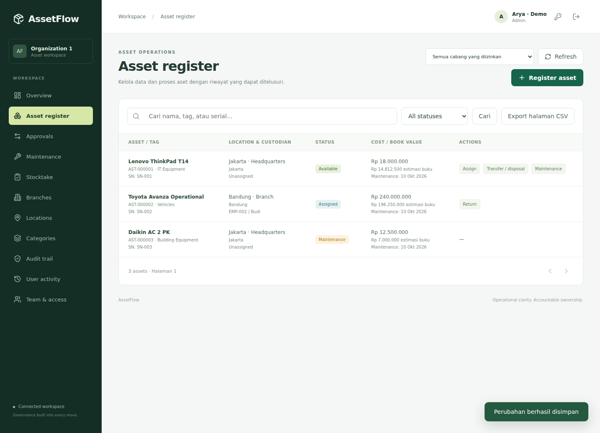
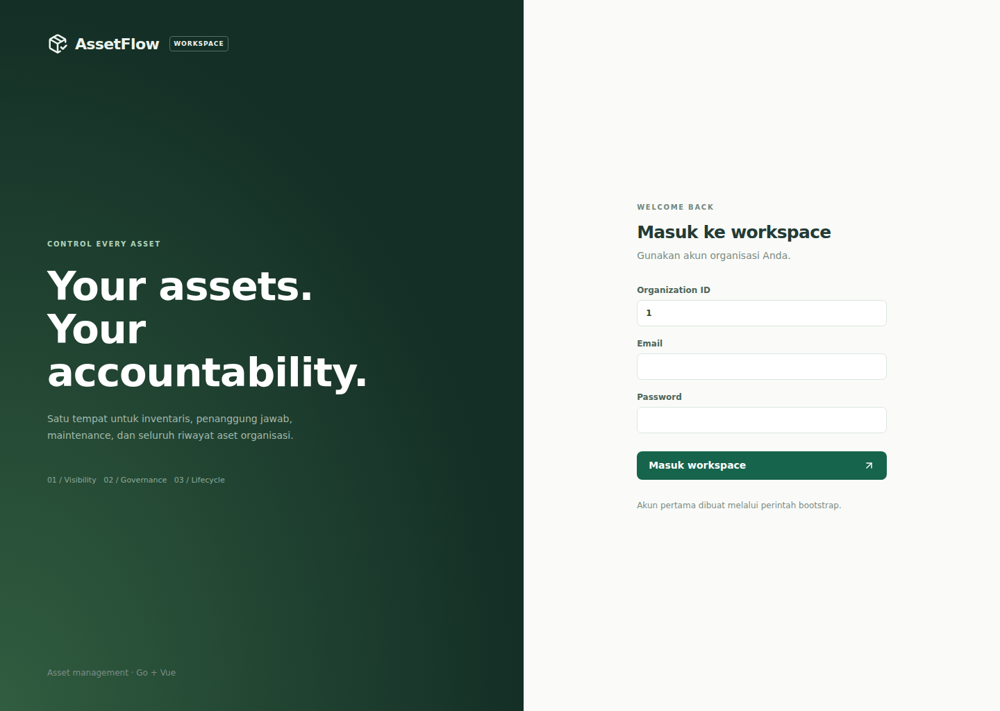
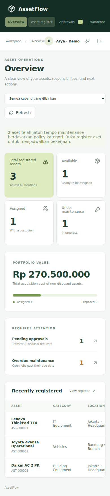
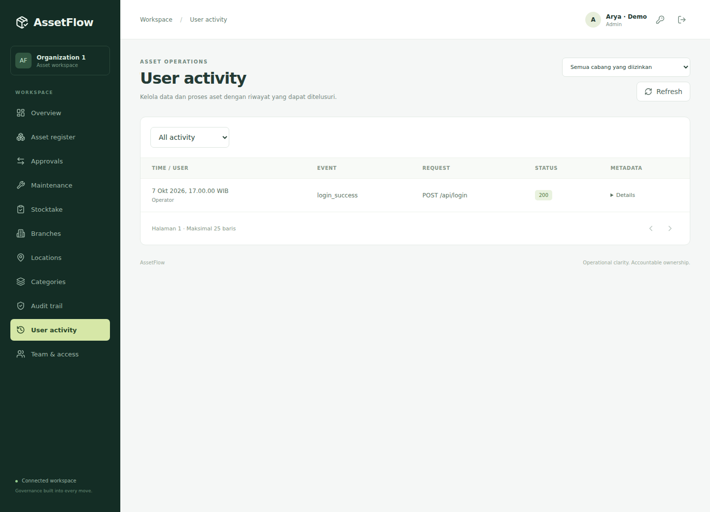

# UI preview

Screenshots are rendered from the actual Vue production bundle. Dashboard/register/mobile records are **demo fixtures**, not production or live backend data.

## Desktop overview

## Asset register

## Login

## Mobile

## User activity

